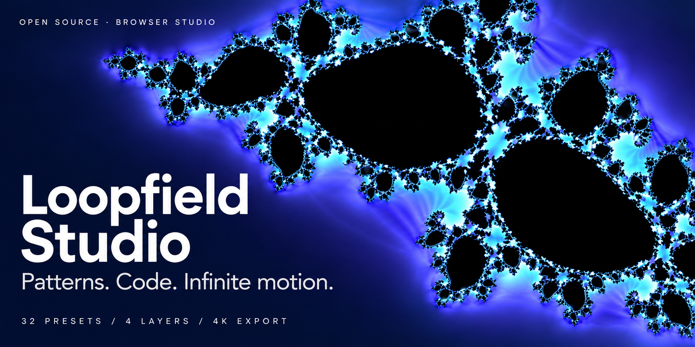

# Loopfield Studio

[English](README.md) · **한국어**

**짧은 GLSL과 프리셋으로 만드는 고해상도 패턴 영상 루프 생성기**



Loopfield Studio는 **WebGL 2 + GLSL** 기반의 브라우저 그래픽 스튜디오입니다.

기하학적 패턴, 프랙탈, 유기적 패턴과 3D 스타일 셰이더를 조합해 반복되는 영상을 만들 수 있습니다.
서버, 로그인, API Key, 별도 렌더링 백엔드 없이 **GitHub Pages 같은 정적 호스팅만으로 실행**됩니다.

일반 사용자는 프리셋과 슬라이더만으로 제작할 수 있으며, 필요하면 직접 GLSL 코드를 작성할 수 있습니다.

상단 **EN / KR** 버튼으로 언어를 전환할 수 있습니다. 프로젝트와 코드 초안은 유지되며, 언어 설정은 현재 브라우저에 저장됩니다.

[사이트 열기](https://jtech-co.github.io/Loopfield-Studio/)

저장된 설정이 없는 첫 접속은 **EN · Prism Bloom**으로 시작합니다. 제목은 선택한 패턴을 따라 바뀌지만 직접 입력한 뒤에는 유지됩니다. 기존 작업과 언어 설정은 복원합니다.

## 주요 기능

- WebGL 2 + GLSL 실시간 렌더링
- 기본 셰이더 프리셋 32개
- 망델브로, 줄리아 등 프랙탈 패턴
- 기하학, 유기적 패턴, 3D 곡면
- 최대 4개 레이어 합성
- GLSL 코드 편집 및 실시간 미리보기
- 블룸, 노출, 대비, 비네트, 색수차
- 루프 경계 검사
- PNG 이미지 출력
- H.264 MP4 영상 출력
- 프로젝트 JSON 가져오기 / 내보내기
- 반응형 데스크톱·태블릿·모바일 UI

## 출력 해상도

| 설정 | 해상도 |
|---|---:|
| Full HD | 1920 × 1080 |
| DCI 2K | 2048 × 1080 |
| QHD | 2560 × 1440 |
| UHD 4K | 3840 × 2160 |

영상은 24 / 30 / 60 FPS와 2~60초 길이를 지원합니다.

미리보기 해상도와 실제 출력 해상도는 서로 분리되어 있습니다.

## GLSL 예제

```glsl
vec3 pattern(vec2 p) {
  float radius = length(p);
  float wave =
    0.5 + 0.5 * cos(radius * 12.0 + uCycle.x * 2.0);

  return palette(
    radius * 0.3 + uCycle.y * 0.2
  ) * wave;
}
```

`uCycle`은 시작점과 끝점이 연결되는 루프 애니메이션을 만들기 위한 시간 좌표입니다.

자세한 내용은 [GLSL API](docs/GLSL_API-KR.md)를 참고하세요.

## 로컬 실행

별도의 빌드 과정이나 `npm install`은 필요하지 않습니다.

```sh
python -m http.server 8000
```

브라우저에서 다음 주소를 엽니다.

```text
http://localhost:8000
```

`index.html`을 `file://` 방식으로 직접 실행하는 것은 지원하지 않습니다.

## GitHub Pages 배포

저장소 루트에 `index.html`이 위치하도록 프로젝트를 업로드한 뒤:

```text
Settings
→ Pages
→ Source
→ GitHub Actions
```

포함된 GitHub Actions 워크플로를 사용해 배포할 수 있습니다.

자세한 내용은 [배포 안내](docs/DEPLOYMENT-KR.md)를 참고하세요.

## 브라우저 지원

MP4 출력에는 다음 기능이 필요합니다.

* WebGL 2
* WebCodecs `VideoEncoder`
* H.264 인코더
* HTTPS 또는 localhost

데스크톱 Chrome / Edge 계열을 우선 대상으로 합니다.

2K·4K 또는 60 FPS 인코딩 가능 여부는 브라우저, GPU, 운영체제와 H.264 인코더 지원에 따라 달라질 수 있습니다.

지원되지 않는 환경에서 해상도를 임의로 낮추거나 WebM 파일을 MP4로 위장하지 않습니다.

## 문서

* [사용 안내](docs/USER_GUIDE-KR.md)
* [GLSL API](docs/GLSL_API-KR.md)
* [아키텍처](docs/ARCHITECTURE-KR.md)
* [배포 안내](docs/DEPLOYMENT-KR.md)
* [검증 보고서](docs/TEST_REPORT-KR.md)

## 라이선스

MIT License

자세한 내용은 [LICENSE](LICENSE)를 참고하세요.
OG 이미지는 `assets/presets/og-site.png`(사이트)와 `og-repository.png`(저장소)입니다. 저장소 이미지는 GitHub 설정의 Social preview에 별도로 등록해야 합니다.
