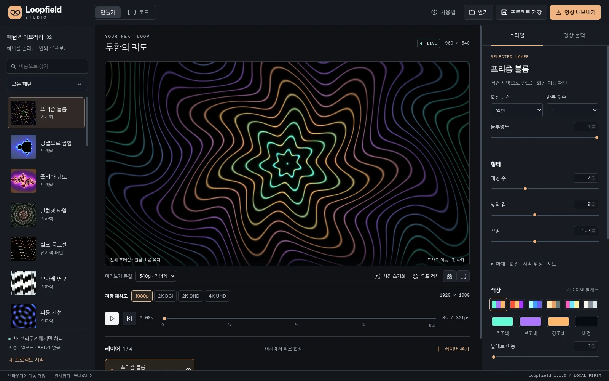

# Loopfield Studio

**짧은 GLSL과 슬라이더로 만드는 고해상도 패턴 영상 루프.**

WebGL 2 · GLSL ES 3.00 · WebCodecs · H.264 MP4 · 정적 호스팅 · 런타임 외부 의존성 0



ShaderDesk Studio와 별개의 영상 제작 프로젝트이다. 배경화면 적용기가 아니라, 패턴을 합성하고 정해진 프레임 수의 MP4를 만드는 브라우저 스튜디오이다. 서버 렌더링, 로그인, API 키, 코드 업로드, 유료 API, CDN 스크립트가 없다. **일반 사용자는 코드를 작성하지 않고도 프리셋과 슬라이더만으로 제작할 수 있다.**

## 시작

GitHub 저장소 루트에 이 폴더의 **내용물**을 올린다. `index.html`이 저장소 루트에 있어야 한다. Settings → Pages → Source를 **GitHub Actions**로 설정한 뒤 포함된 `Deploy Loopfield Studio` 워크플로를 실행한다. 별도 빌드나 npm 설치는 없다. [배포와 도메인 연결](docs/DEPLOYMENT.md)

로컬 개발은 프로젝트 폴더에서 다음 중 하나를 실행한다.

```sh
# Python 설치 환경
python -m http.server 8000
# Windows Python Launcher 환경에서는 py -m http.server 8000 도 가능
```

브라우저에서 `http://localhost:8000`을 연다. `index.html` 더블클릭(file://) 실행은 지원하지 않는다. Python은 로컬 정적 파일 확인용일 뿐 배포 서버나 영상 처리 백엔드가 아니다.

## 만들기 → 합성 → 출력

왼쪽에서 패턴을 선택하고 오른쪽에서 형태와 색을 바꾼다. 필요하면 레이어를 추가한다. 상단 **영상 내보내기**에서 크기·FPS·길이·압축 품질을 선택하고, **지원 확인**과 **루프 검사** 후 MP4를 만든다. 메모리 방식은 완료 후 MP4 다운로드 버튼을 누르고, 직접 저장 방식은 선택한 파일에 기록한다.

| 항목 | 구현 내용 |
|---|---|
| 프리셋 | 프리즘, 망델브로, 줄리아, 만화경, 실크 등고선, 모아레, 파동 간섭, 보로노이 셀, 유체 지형, 궤도 링, 자이로이드, 코드 시작점 |
| 합성 | 최대 4레이어, 일반·스크린·더하기·곱하기·차이, 불투명도·정렬·복제·표시 토글 |
| 마무리 | 블룸, 노출, 대비, 비네트, 색수차, 정적 디더링 |
| 편집 | 직접 GLSL, 문법 강조, 사용자 슬라이더 생성, 에러 행 표시, 실패 시 마지막 정상 셰이더 유지 |
| 영상 | H.264/AVC MP4, 24·30·60fps, 2~60초, 오디오 없는 SDR 영상 |
| 보관 | 로컬 자동 저장, JSON 프로젝트 가져오기/내보내기, GLSL 저장, 원본 해상도 PNG |
| 사용성 | 한국어 UI, 키보드 조작, 모바일/태블릿 레이아웃, 미리보기와 출력 해상도 분리 |

## 출력 크기

| 표시 | 가로형 픽셀 |
|---|---:|
| 1080p · Full HD | 1920 × 1080 |
| QHD · 1440p | 2560 × 1440 |
| DCI 2K | 2048 × 1080 |
| 4K · UHD | 3840 × 2160 |

QHD를 DCI 2K와 같은 크기로 표시하지 않는다. Full HD/QHD/UHD는 세로형과 정사각형도 선택할 수 있다. 정사각형의 변 길이는 각각 1080/1440/2160px이다. DCI 2K는 2048×1080 고정이다. **출력은 선택한 픽셀 수로 다시 렌더링하며, 미리보기 캔버스를 확대 저장하지 않는다.**

## 5줄로 시작하는 코드

```glsl
vec3 pattern(vec2 p) {
  float radius = length(p);
  float wave = 0.5 + 0.5 * cos(radius * 12.0 + uCycle.x * 2.0);
  return palette(radius * 0.3 + uCycle.y * 0.2) * wave;
}
```

`uCycle`은 한 바퀴 돌아 출발점으로 돌아오는 시간 좌표이다. `uTime`을 임의로 선형 이동에 쓰면 끝점이 연결되지 않을 수 있다. 프리셋은 주기 함수를 사용하며 사용자 코드에는 끝점 샘플 검사를 제공한다. [GLSL API와 예제](docs/GLSL_API.md)

## 구현 방식

```text
GLSL 레이어 → WebGL 합성 → 블룸/색 보정 → 지정 해상도 프레임
→ WebCodecs H.264 인코더 → AVC 전용 MP4 muxer → 기기에 저장
```

프레임 i의 위상은 `i / (길이 × FPS)`이다. 렌더링이 느려도 프레임을 버리거나 영상 시간을 실제 작업 시간에 맞추지 않는다. 마지막 중복 끝점은 넣지 않는다. 한 주기의 파일이며 플레이어의 반복 재생 기능을 켜야 반복된다.

## 중요한 지원 범위

**v1.0.0 기능 구현본이며, 모든 기기에서 인코딩이 검증된 상용 서비스 인증판은 아니다.** WebGL 실제 렌더, 4K 프레임, UI 조작, MP4 컨테이너 및 실제 AVC 디코딩 검증을 수행했다. 다만 제작 환경에서는 secure-origin 네이티브 WebCodecs 인코딩을 실행하지 못했다. 공개 전 대상 기기에서 [브라우저 검사 페이지](tests/browser.html)를 실행해야 한다. [검증 범위와 결과](docs/TEST_REPORT.md)

MP4에는 HTTPS 또는 localhost, WebCodecs VideoEncoder, 선택 크기의 H.264 인코더가 필요하다. 데스크톱 Chrome/Edge를 우선 대상으로 작성했지만 브라우저 이름만으로 4K/60fps를 보장하지 않는다. Safari/Firefox/모바일은 실제 지원 확인에 따른다. 지원하지 않을 때 WebM에 .mp4 확장자를 붙이거나 몰래 해상도를 낮추지 않는다.

디스크 직접 저장은 File System Access API 제공 환경에서만 표시된다. 그 외에는 메모리 다운로드로 저장하며 인코딩 페이로드 256 MiB 한도가 있다. 표시 비트레이트와 파일 크기는 목표/추정치이다. GPU 메모리, 탭 절전, 코덱 제한에 따라 출력이 중단될 수 있다.

망델브로·줄리아는 실제 반복 수식이며 GPU float 정밀도로 계산한다. 무한 딥줌·임의 정밀도, 오디오 합성, HDR/10bit, 알파 MP4, HEVC/AV1, 피드백 버퍼, 외부 텍스처, 전체 Shadertoy 호환은 포함하지 않는다.

## 문서와 예제

[사용 안내](docs/USER_GUIDE_KO.md) · [GLSL API](docs/GLSL_API.md) · [아키텍처](docs/ARCHITECTURE.md) · [배포](docs/DEPLOYMENT.md) · [검증 보고서](docs/TEST_REPORT.md) · [공식 참고자료](docs/SOURCES.md)

`examples/`에 바로 열 수 있는 JSON 프로젝트 3개와 GLSL 코드 예제 3개를 제공한다.

```text
index.html             앱 진입점
css/                   반응형 스튜디오 UI
js/                    셰이더·합성·편집·MP4·출력 모듈
assets/                SVG 아이콘과 실제 렌더 프리셋 썸네일
docs/                  운영·개발 문서와 검증 자료
examples/              샘플 프로젝트와 GLSL
tests/                 단위 테스트, 실제 AVC 검사, 기기 검증 페이지
.github/workflows/     정적 Pages 배포
```

## 개발 검증

```sh
node --test tests/*.test.mjs
# 선택 사항: Python + Node + FFmpeg/ffprobe가 설치되어 있을 때
python tests/validate_media.py
```

브라우저의 `tests/browser.html`은 설치 없이 동작한다. `package.json`은 선택적 개발 편의용이며 `npm install`을 요구하지 않는다. 런타임에 FFmpeg, Python, Node, WASM 코덱은 들어가지 않는다.

MIT 라이선스. 코드와 기본 프리셋의 수정·재배포를 허용한다. 코덱 특허 또는 제3자 삽입 콘텐츠의 권리까지 부여하는 라이선스는 아니다. [LICENSE](LICENSE)
